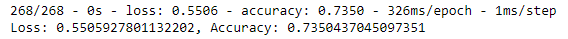
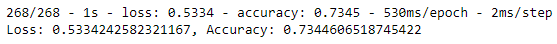
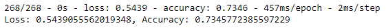

# Neural_Network_Charity_Analysis

## Overview
The purpose of this analysis to support AlphabetSoup, a non-profit organization providing aid for environmental protection, in identifying which applications to approve. This will be accomplished with the use of neural networks.

## Results
Data Preprocessing

- Target Variable: "IS_SUCCESSFUL", which is a bnary column identifying whether the grant was successful or not.
- Feature Variables: All of the following variables are feature variables which support the model in correctly identifyng successful campaigns.
     - APPLICATION_TYPE—Alphabet Soup application type
     - AFFILIATION—Affiliated sector of industry
     - CLASSIFICATION—Government organization classification
     - USE_CASE—Use case for funding
     - ORGANIZATION—Organization type
     - STATUS—Active status
     - INCOME_AMT—Income classification
     - SPECIAL_CONSIDERATIONS—Special consideration for application
     - ASK_AMT—Funding amount requested
- Removed Variables (neither targets nor features): Both of the column headers below provide information that is either completely unique or will not support the model in identifying patterns and, thus, will be removed.
     - EIN: An identification number column.
     - NAME: The name of the organization requesting the grant.

Compiling, Training, and Evaluating the Model
- Neural Network Model Neurons, Layers, and Activation Functions: In trial 3 the model had the following design, all using the sigmoid function
     - Layer 1, 12 neurons
     - Layer 2, 10 neurons 
     - Layer 3, 8 neurons
- Target Model Performance: The target model performance was unable to be achieved. The initial performance was 73.5% (see image below) and the target was 75%. After the aforementioned adjustments, the performance was nearly the same as the start at 73.5% accuracy.

**Trial 1 Accuracy** 

- Steps Taken To Increase Model Performance: The following steps were taken in trial 2 and trial 3 to attempt to increase model performance. However, the model performance remained relatively similar to the original and the goal performance was not achieved. 
     - Trial 2: It was postulated that the name feature may actually me useful to this model because there were many duplicates, indicating that several organizations had applied multiple times. After including the name column and binning the feature variable, the model was run with little to no improvement in performance.
     
     **Trial 2 Accuracy** 

     
     
     - Trial 3: The functions were changed from a mixture of relu and sigmoid to all sigmoid. After addng another hidden layer (3 total hidden layers), neurons were increased to 12, 10, and 8, respectively.
     
     **Trial 3 Accuracy** 

     
     

## Summary
The neural network model was unable to achieve the 75% accuracy target and, instead, hovered around 73% accuracy. It is possible that the neural network is overfitting this dataset and that a different model would yield higher accuracy. Logistic regression might be a good candidate because it is useful on categorical data, like the targer variable, "IS_SUCCESSFUL" in this case. 
